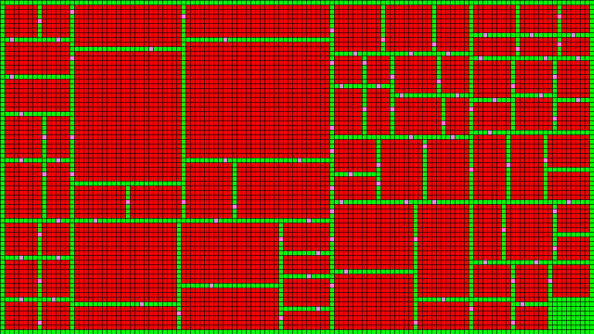

# Dungeon Generation
  

### Example

-  `Floor`
-  `Wall`
-  `Door`

#### BSP Basic

### Source of inspiration

* https://bfnightly.bracketproductions.com/chapter_0.html
* https://www.roguebasin.com/index.php?title=Articles#Map
* https://www.gridsagegames.com/blog/2014/06/procedural-map-generation/

### Contribution

Contribution is very welcome! If you didn't contribute before, just filter for issues with "easy" or "good first issue" label. Please note that your contributions are assumed under Boost Licence.

### Licence

cf [Boost Licence](http://www.boost.org/LICENSE_1_0.txt)